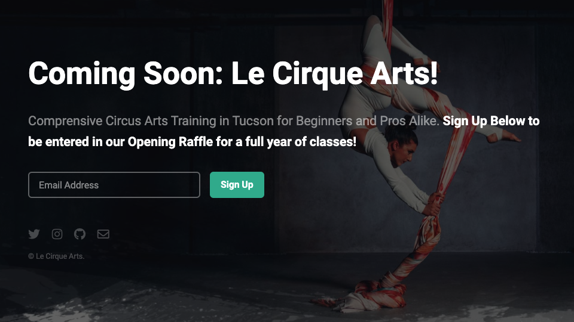

# "Le Cirque Arts" Landing Page
Landing page for upcoming circus arts academy. 

**Link to project:** https://lecirqueartstucson.netlify.app/

## How It's Made:

**Tech used:** HTML, CSS, JavaScript, SASS

This is a simple landing page for a soon-to-open circus arts academy. The site is designed to boost interest and provide the business with an email audience to market to as they open. The page cycles through a series of high "wow factor" images showcasing different circus arts.

## Optimizations
*(optional)*

I would like to refine the manner in which the images are shown so the experience is smoother. I plan to go back to address that in the near future. The code also needs to be refactored as elements added later are currently grouped separately.

